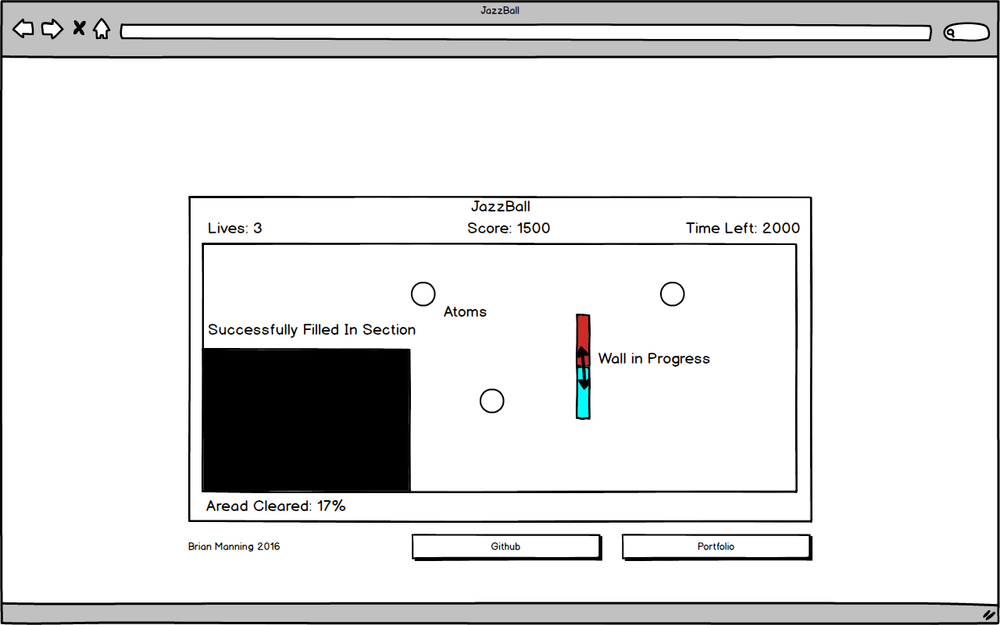

# JazzBall

## Background

JazzBall is a single player area capture game based on Jezz Ball, originally published for Microsoft Windows. The player must capture areas of a rectangular playing field containing atoms which bounce around within the space. Players can initiate building a wall by clicking the desired start location for that wall. Once initiated, the wall will slowly build in both directions from the click point. When each section of the wall reaches the edge of the playing field, it becomes solid and the atoms can now bounce off it. However, if an atom collides with either section of the wall before it is finished being built the entire wall section will disappear and the player will lose a life. If a section of the playing field is completely walled off and contains no atoms, that section will completely fill in. Pressing the spacebar allows the user to alternate between initiating vertical or horizontal walls.

If the player successfully fills in 75% of the playing field before the time for that level runs out, the level is won and the next level begins with one additional starting atom. Each level begins with a number of lives equal to the number of starting atoms (the first level starts with two atoms). If all lives are lost within a level, the game is lost and the player's score is tallied.

## MVP

While playing JazzBall, players will be able to:
- [ ] Start, pause, or quit the game in progress.
- [ ] Choose when the next level will begin and view their score and time remaining as each level progresses.
- [ ] Access an instructional page that explains the gameplay.

This project will also include a production readme.

## Wireframes

This app will consist of a single screen containing the playing field, options to "Start Game" or "Learn to Play," and links to my Github profile and Portfolio website. In game, the player will be able to view the amount of lives they have remaining, their current running score, the time remaining, and the percent area they have cleared so far.

## Architecture and Technologies

I plan to use Easel.js with HTML5 Canvas, CSS3, and JavaScript to create this project. I anticipate having difficulty fully debugging the collision mechanics because glitches may not be repeatable. For example. if I notice that an atom can hop over a wall or cross a corner between two walls in certain situations it may not be straight forward to recreate the game situation that led there.

The following scripts will be necessary:
- [ ] `board.js` - The playing field that contains all atoms and completed walls. Responsible for recognizing completely walled off sections that contain no atoms and filling them in accordingly.
- [ ] `atom.js` - A moving object that moves at a constant velocity. Must respond to collisions with other atoms or any completed walls.
- [ ] `wall_builder.js` - A moving wall in progress that will respond when it either it's head reaches a completed wall or an atom collides with it.
- [ ] `game_view.js` - stores a game instance and a canvas to draw the game onto. Also responsible for installing key listeners for gameplay.
- [ ] `util.js` - Responsible for calculating the resulting velocity vectors for atoms after collisions.
- [ ] `scoreboard.js` - Keeps track of and displays time remaining, score, lives, and percent cleared.

## Phase 1: Project set up, how to play page, and bouncing atomss.

**Objective:** Configure webpack.config.js and package.json. Learn easel.js and create a playing field with two atoms that bounce around. Player can build walls, but nothing will respond to collisions yet and walled off sections without atoms will not be filled in.

[ ] Render the initial title page.
[ ] When user clicks "New Game" render a screen with two atoms bouncing around.
[ ] User can build horizontal and vertical walls.

## Phase 2: Collision logic, wall interruption, countdown timer, and lives counter.

**Objective:** Atoms properly respond to collisions with each other and with newly completed walls. When an atom collides with a wall in progress, it is destroyed and the remaining number of lives is decremented.

[ ] Implement the detection of collisions
[ ] Calculate the resulting velocity vectors for two colliding atoms.
[ ] Calculate the resulting velocity vectors for an atom colliding with a wall.

## Phase 3: Automatic filling in of walled off sections, score tracking.

**Ovjective:** Walled off sections of the playing field are automatically filled in, percent filled is updated, and level completions are triggered when 75% is reached.

[ ] The game recognizes when a section of the playing field is completely walled off, responding by filling it in.
[ ] Track percentage of the playing field filled in.
[ ] Trigger the start of a new level with an additional ball once 75% fill is achieved.
[ ] Track the player's score by keeping track of the total amount of filled in area across all levels played so far (this rewards players who set up their last wall to fill in an area that exceeds the 75% victory condition by as much as possible each level).

## Bonus

[ ] Sound effects and music
[ ] Explosion animations for interrupted walls.
